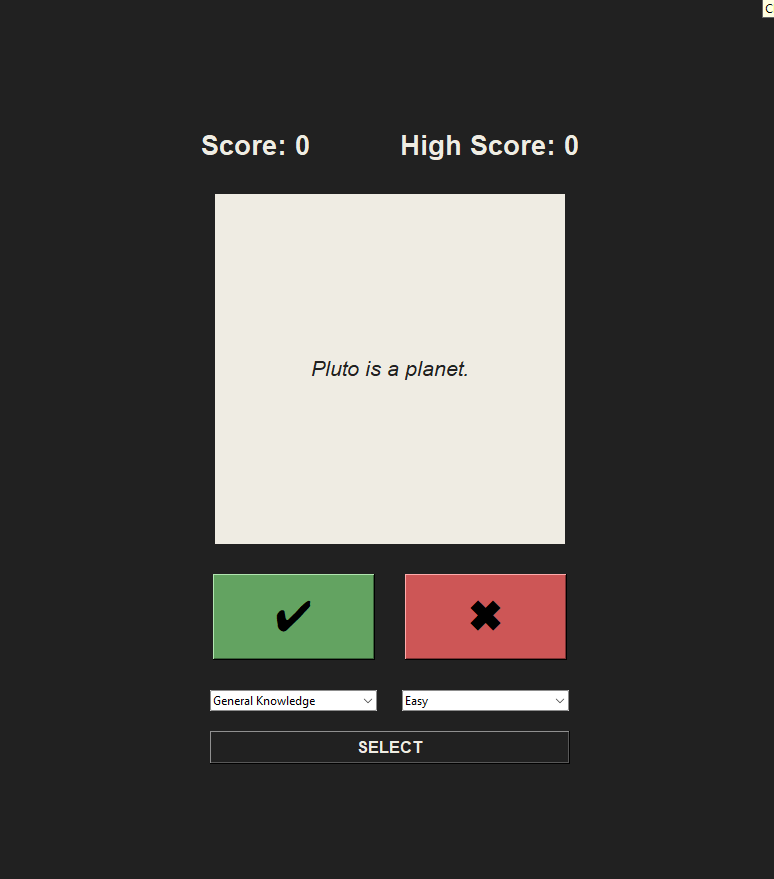
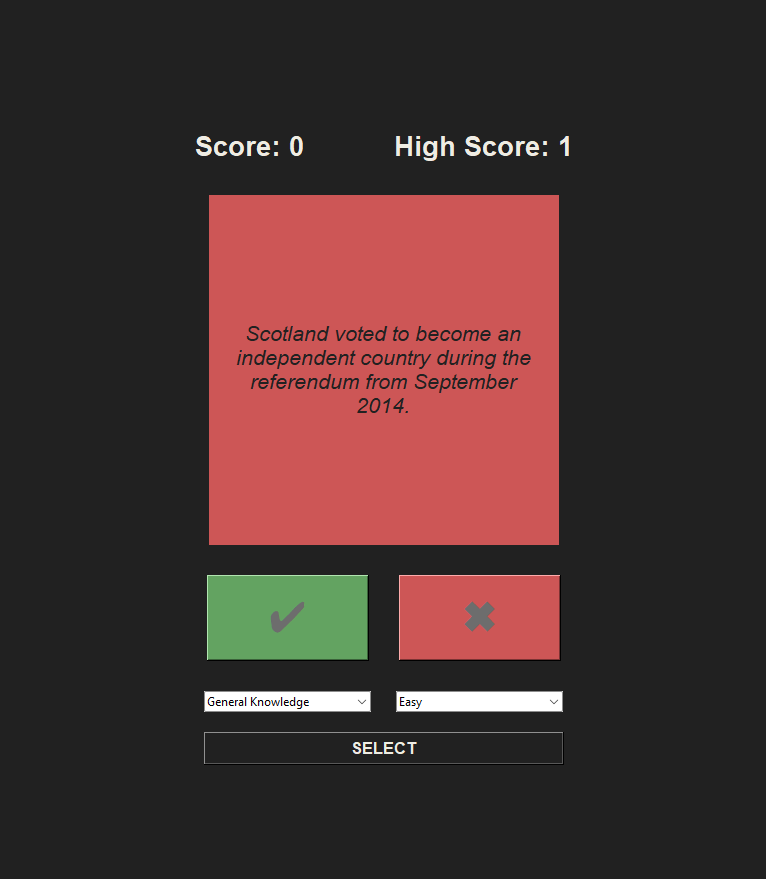
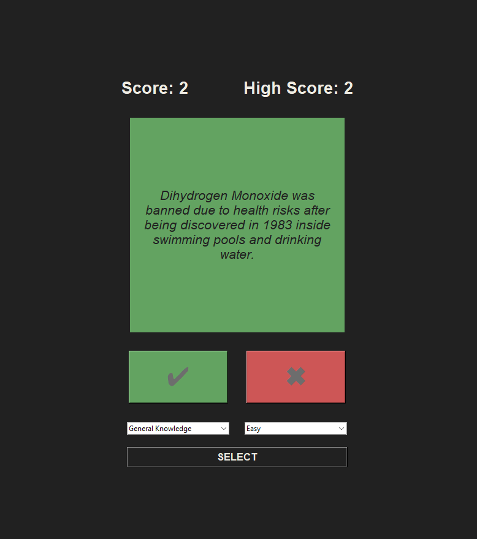

# 🎯 **Quizzler – A Simple True/False Quiz App**

Quizzler is a Python-based quiz application built with **Tkinter** and powered by the **Open Trivia Database API**.
It allows users to choose a category and difficulty, answer True/False questions, and track their score and high score.

---

## 🖼️ Screenshots




---

## ✅ **Features**

✅ Clean and minimal Tkinter UI
✅ Fetches fresh quiz questions from **OpenTDB API**
✅ Category & difficulty selection
✅ True/False gameplay
✅ Score + persistent high score system
✅ Color feedback for correct & incorrect answers
✅ Lightweight and fast

---

## 🖥️ **Tech Stack**

* **Python 3**
* **Tkinter** (GUI)
* **Requests** (API calls)
* **JSON** (data storage)
* **Open Trivia Database** API

---

## 📂 **Project Structure**

```
Quizzler/
│── main.py
│── classes.py
│── guess_data.json        # auto-generated quiz data
│── high_score.txt         # saved high score
│── README.md
```

---

## 🚀 **How to Run**

### 1. Install required packages

```bash
pip install requests
```

### 2. Run the application

```bash
python main.py
```

---

## 📦 **Building the EXE (Optional)**

If you want to convert this app into a standalone Windows executable:

```
pyinstaller --onefile --windowed main.py
```

Your EXE will be located inside the **dist/** folder. (Or you can just downlaod and use my the exe i already converted)

---


## 🌐 API Used

This project uses the **OpenTDB** (Open Trivia Database):
[https://opentdb.com/](https://opentdb.com/)

---

## 📝 **Notes**

* `guess_data.json` is auto-generated and refreshed when new questions are fetched.
* `high_score.txt` stores the highest score achieved locally.
* Currently, only **General Knowledge** category is enabled (expandable in code).

---

## 🤝 Contributing

Pull requests are welcome!
If you’d like to add new features (UI upgrades, categories, sounds, animations), feel free to open an issue.

---

## 📄 License

This project is open-source under the **MIT License**.

---

